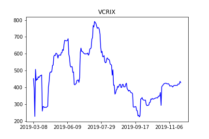

[](http://quantlet.de/)

## [](http://quantlet.de/) **BTC&VCRIX** [](http://quantlet.de/)

```yaml

Name of QuantLet : 'BTC&VCRIX'

Published in : 'Emoji-Embedding-For-Finance' 

Description : 'info about BTC price and VCRIX.'

Keywords : 'Emoji , BTC, VCRIX'

Author : 'WK Haerdle Zuo Xiaorui'

Submitted : Wed, Feb 3 2023
```




### [IPYNB Code: BTC&VCRIX.ipynb](BTC&VCRIX.ipynb)


automatically created on 2024-02-07