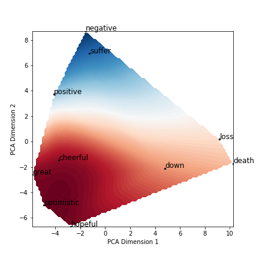

[](http://quantlet.de/)

## [](http://quantlet.de/) **Bert Space** [](http://quantlet.de/)

```yaml

Name of QuantLet : 'Bert Space'

Published in : 'Emoji-Embedding-For-Finance' 

Description : 'Showing examples of Bert embedding'

Keywords : 'embedding , Bert'

Author : 'WK Haerdle Zuo Xiaorui'

Submitted : Sat, Feb 17 2023
```



### [IPYNB Code: Bert Space.ipynb](Bert Space.ipynb)


automatically created on 2024-02-18