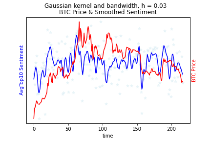
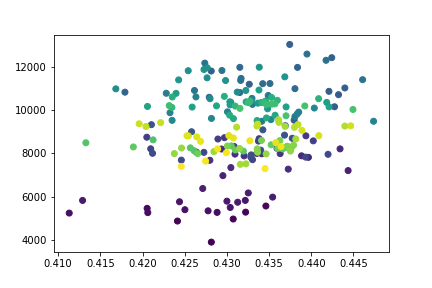
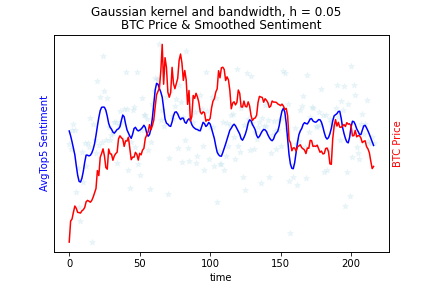
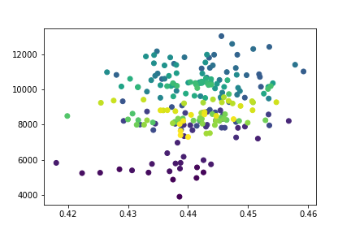

[](http://quantlet.de/)

## [](http://quantlet.de/) **Emoji-BTC** [](http://quantlet.de/)

```yaml

Name of QuantLet : 'Emoji-BTC'

Published in : 'Emoji-Embedding-For-Finance' 

Description : 'Check the relationship between BTC price and Emoji sentiment.'

Keywords : 'Emoji , Embedding'

Author : 'WK Haerdle Zuo Xiaorui'

Submitted : Tue, Feb 6 2023
```









### [IPYNB Code: Emoji-BTC.ipynb](Emoji-BTC.ipynb)


automatically created on 2024-02-07