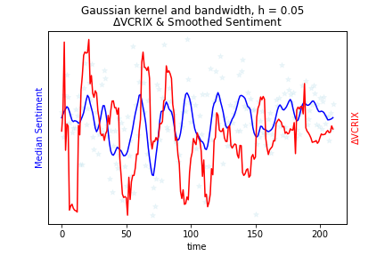
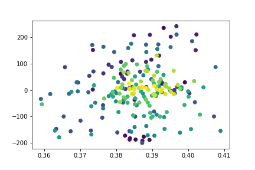

[](http://quantlet.de/)

## [](http://quantlet.de/) **Emoji-VCRIX** [](http://quantlet.de/)

```yaml

Name of QuantLet : 'Emoji-VCRIX'

Published in : 'Emoji-Embedding-For-Finance' 

Description : 'Check the relationship between delta VCRIX and Emoji sentiment.'

Keywords : 'Emoji , Embedding, VCRIX'

Author : 'WK Haerdle Zuo Xiaorui'

Submitted : Tue, Feb 6 2023
```





### [IPYNB Code: Emoji-VCRIX.ipynb](Emoji-VCRIX.ipynb)


automatically created on 2024-02-07