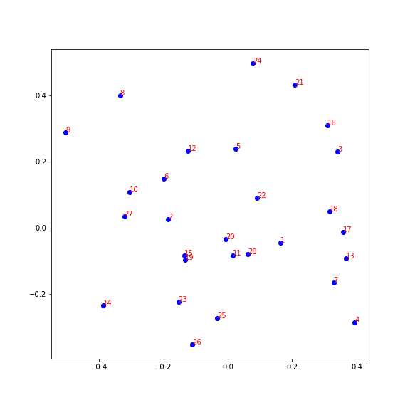

[](http://quantlet.de/)

## [](http://quantlet.de/) **Eye_Opener** [](http://quantlet.de/)

```yaml

Name of QuantLet : 'Eye_Opener'

Published in : 'Emoji-Embedding-For-Finance' 

Description : 'An eye opener example of ResNet50 3D figure embedding of emojis. No guarantee everytime the same result because of the random seed.'

Keywords : 'ResNet , Embedding'

Author : 'WK Haerdle Zuo Xiaorui'

Submitted : Thu, Nov 11 2023

```



### [IPYNB Code: Eye_Opener.ipynb](Eye_Opener.ipynb)


automatically created on 2023-12-03