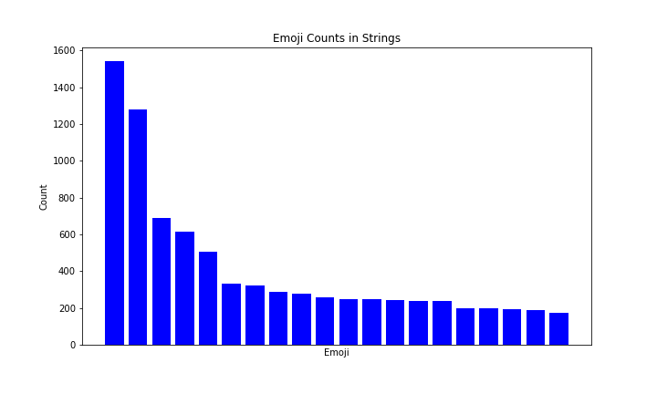

[](http://quantlet.de/)

## [](http://quantlet.de/) **Frequency Generate** [](http://quantlet.de/)

```yaml

Name of QuantLet : 'Frequency Generate'

Published in : 'Emoji-Embedding-For-Finance' 

Description : 'Generate the descirption of the raw data of the training set.'

Keywords : 'Emoji , Embedding'

Author : 'WK Haerdle Zuo Xiaorui'

Submitted : Tue, Feb 6 2023
```



### [IPYNB Code: Frequency Generate.ipynb](Frequency Generate.ipynb)


automatically created on 2024-02-07