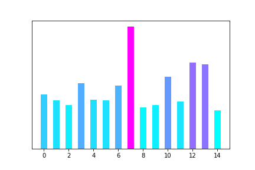
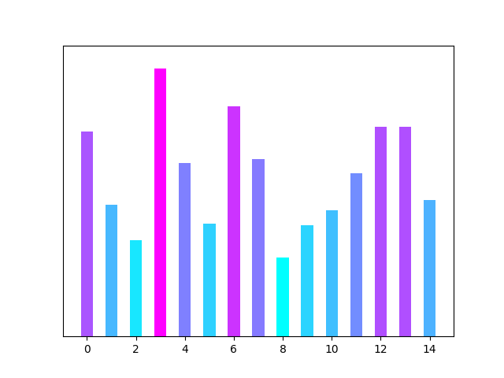

[](http://quantlet.de/)

## [](http://quantlet.de/) **Our Model vs BERT** [](http://quantlet.de/)

```yaml

Name of QuantLet : 'Our Model vs BERT'

Published in : 'Emoji-Embedding-For-Finance' 

Description : 'Generating the comparison pictures. Contact xiaoruizuo87@gmail.com if you want the .pth file.'

Keywords : 'Emoji , Embedding'

Author : 'WK Haerdle Zuo Xiaorui'

Submitted : Tue, Feb 6 2023

```





### [IPYNB Code: Our Model vs BERT.ipynb](Our Model vs BERT.ipynb)


automatically created on 2024-02-07