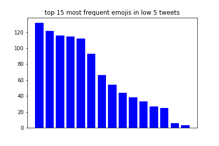
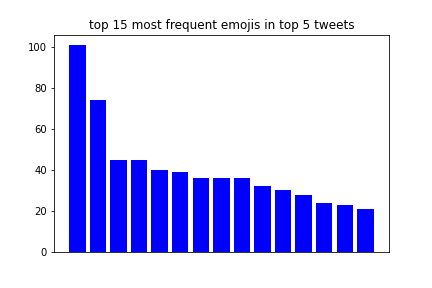

[](http://quantlet.de/)

## [](http://quantlet.de/) **Possitive Negative Emojis** [](http://quantlet.de/)

```yaml

Name of QuantLet : 'Possitive Negative Emojis'

Published in : 'Emoji-Embedding-For-Finance' 

Description : 'Generate the picture of the most Possitive/Negative emoji groups.'

Keywords : 'Emoji , Embedding'

Author : 'WK Haerdle Zuo Xiaorui'

Submitted : Tue, Feb 6 2023
```





### [IPYNB Code: Possitive Negative Emojis.ipynb](Possitive Negative Emojis.ipynb)


automatically created on 2024-02-07