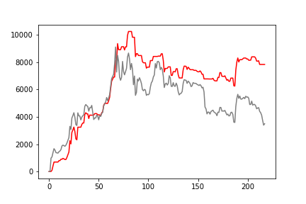

[](http://quantlet.de/)

## [](http://quantlet.de/) **Strategy** [](http://quantlet.de/)

```yaml

Name of QuantLet : 'Strategy'

Published in : 'Emoji-Embedding-For-Finance' 

Description : 'calculation about BTC strategy.'

Keywords : 'Emoji , BTC'

Author : 'WK Haerdle Zuo Xiaorui'

Submitted : Thu, Feb 8 2023
```



### [IPYNB Code: Strategy.ipynb](Strategy.ipynb)


automatically created on 2024-02-08