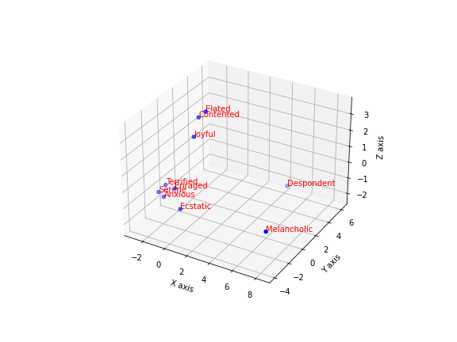

[](http://quantlet.de/)

## [](http://quantlet.de/) **Word_Embedding_Eyeopen** [](http://quantlet.de/)

```yaml

Name of QuantLet : 'Word_Embedding_Eyeopen'

Published in : 'Emoji-Embedding-For-Finance' 

Description : 'An example of word embedding via Bert.'

Keywords : 'Bert , Embedding'

Author : 'WK Haerdle Zuo Xiaorui'

Submitted : Sat, Nov 11 2023

```



### [IPYNB Code: Word_Embedding_Eyeopen.ipynb](Word_Embedding_Eyeopen.ipynb)


automatically created on 2023-12-03